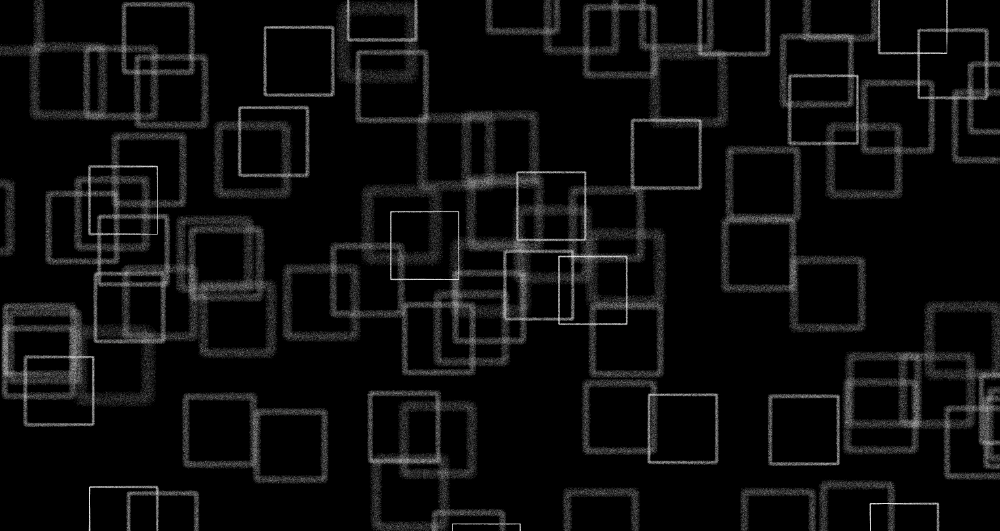

# P5 Experiments

Some fun experiments with P5 as I learn the library.

# Textual Instrument

## Setup

Type the following commands into a terminal

    openssl req -x509 -newkey rsa:4096 -keyout key.pem -out cert.pem -days 365

Set a passphrass and take note of it.

# Run (my setup)

1.  Run the https server

    python server.py

2. Run BERT 
(in another terminal instance)

    z meaning; conda activate meaning; export FLASK_APP=word2vec.py; flask run

3. Run Ollama 
(in another terminal instance)

    ollama serve

4. Open Firefox

    Navigate to https://localhost:8101/instrument/html/index.html

5. Start MIDI Guitar 2

    Input: USB AUDIO CODEC
    Output: Virutal Midi... Bus 1