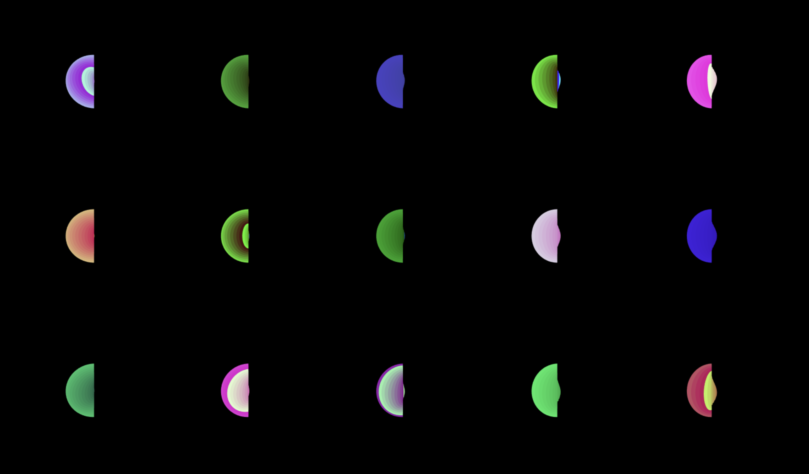

# P5 Experiments

Some fun experiments with P5 as I learn the library.

# To run

Type the following commands into a terminal

    openssl req -x509 -newkey rsa:4096 -keyout key.pem -out cert.pem -days 365

    python server.py

Navigate to

    https://localhost:8101/html/instrument_study_1.html

It has been tested on Firefox